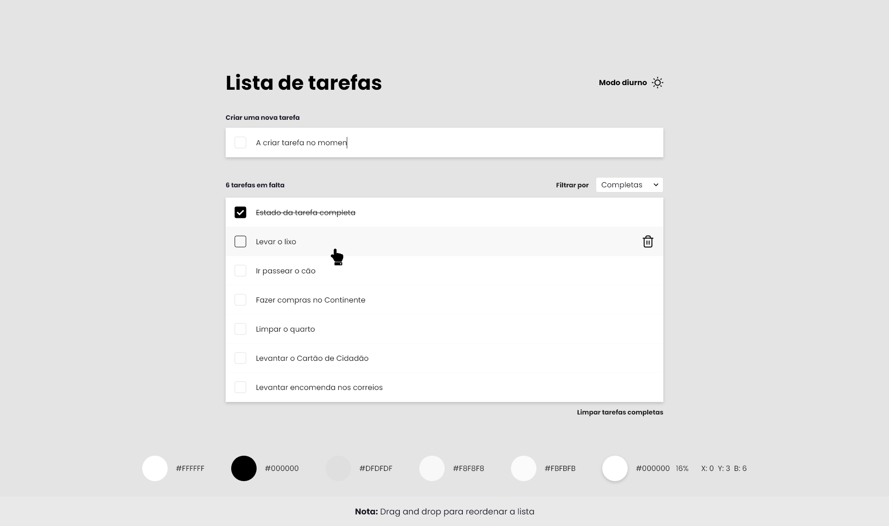

# Todo app

## Welcome! 👋

**To do this challenge, you need a good understanding of HTML, CSS and JavaScript.**

## The challenge

Your challenge is to build out this todo app and get it looking as close to the design as possible.
If possible, avoid using any CSS Frameworks such as Bootstrap/tailwind or JS component libraries such as MaterialUI/ChakraUI.
It is highly appreciated if you try to use the already configured SCSS compiler and try to write your own style ruleset.

Your users should be able to:

- View the optimal layout for the app depending on their device's screen size
- See hover states for all interactive elements on the page
- Add new todos to the list
- Mark todos as complete
- Delete todos from the list
- Filter by all/active/complete todos
- Clear all completed todos
- Toggle light and dark mode
- **Bonus**: The todos data should be stored through refreshes.
- **Bonus**: Drag and drop to reorder items on the list

## Where to find everything

Your task is to build out the project to the designs inside the `/design` folder. The app must be responsive. 

The design is in JPG static format. Using JPGs will mean that you'll need to use your best judgment for styles such as `font-size`, `padding` and `margin`. 

You will find all the required assets in the `/images` folder. The assets are already optimized.

This repo is already pre-configured with the default vite react-ts template.
[React official docs](https://react.dev/)

## Building your project

Feel free to use any workflow that you feel comfortable with. Below is a suggested process, but do not feel like you need to follow these steps:

1. Clone the repository using git clone https://github.com/Logrise/FrontEnd-TodoExercise.git
2. Make the necessary changes to the code.
3. Commit the changes using git commit -m "<commit-message>".
4. Push the changes to the remote repository using git push.
5. Share the repository URL with the evaluator for code evaluation.

## Create a custom `README.md`

We strongly recommend overwriting this `README.md` with a custom one. We've provided a template inside the [`README-template.md`](./README-template.md) file in this starter code.

The template provides a guide for what to add. A custom `README` will help you explain your project and reflect on your learnings. Please feel free to edit our template as much as you like.

Once you've added your information to the template, delete this file and rename the `README-template.md` file to `README.md`. That will make it show up as your repository's README file.

**Have fun building!** 🚀