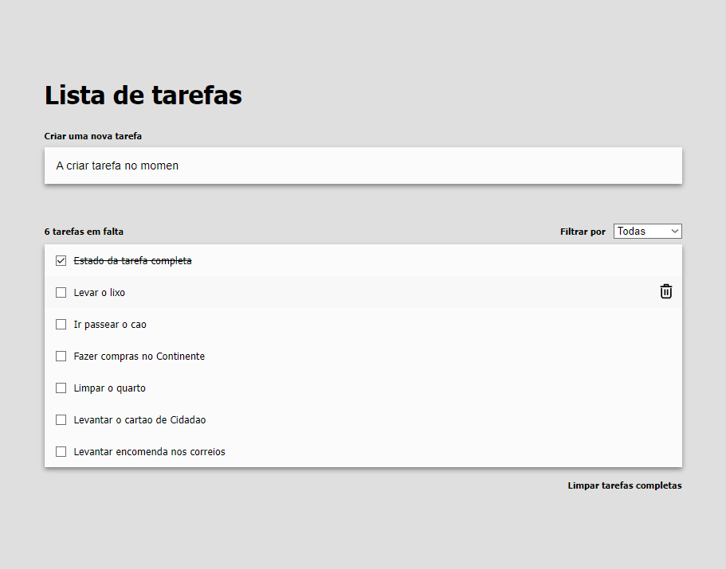

# Todo app solution

## Table of contents

- [Overview](#overview)
  - [The challenge](#the-challenge)
  - [Screenshot](#screenshot)
  - [Links](#links)
- [My process](#my-process)
  - [Built with](#built-with)
  - [Difficulcites](#difficulites)
  - [What I learned](#what-i-learned)

**Note: Delete this note and update the table of contents based on what sections you keep.**

## Overview

### The challenge

Users should be able to:

- View the optimal layout for the app depending on their device's screen size
- See hover states for all interactive elements on the page
- Add new todos to the list
- Mark todos as complete
- Delete todos from the list
- Filter by all/active/complete todos
- Clear all completed todos

**Note: Fill with the functionalities you managed to implement while doing the challenge.**

### Screenshot

## My process
- Startet by analising components from screenshot,
- after identifying some, created one by one, started with Form
Form
- inside Form component introduced a textbox
- created a new const for object with a state from inputbox
- tested object format with console.log
- after got all right information, stored object inside an array
TaskList
- created a TaskList component to display array of tasks
- added checkbox, and changed the text type of task when toggled
- displayed number of tasks left to be done
- added a filter all/complete/active
- added clear all completed tasks button

- implemented style changes to match requirements, and tried to do responsive layout

**Note: Quick summary of your tought process while doing the challenge. No big deal.**

### Built with

- Semantic HTML5 markup
- CSS custom properties
- Flexbox
- CSS Grid
- [React](https://reactjs.org/) - JS library

### Difficulties

 - struggled with costumising checkbox
 - light/dark mode toggle
 - difficulty in applying drag and drop button
 most of the difficulties is due to lack of time
